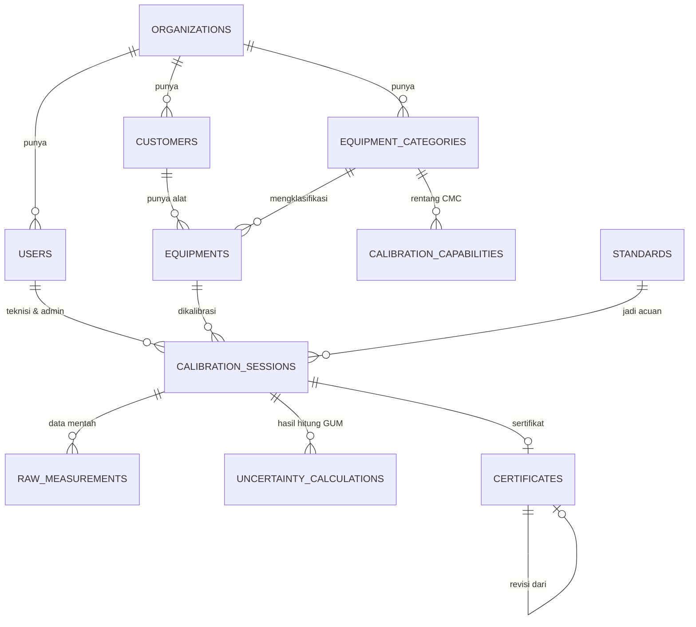

# Tuesday, 14 July 2026

⬅️ [[Minggu 01 - Setup & Fondasi]] · 🏠 [[Dashboard]]

[[2026-07-13|← Hari sebelumnya]] | [[2026-07-15|Hari berikutnya →]]

**Minggu 1 Hari ke-2** — Setup & Fondasi

## Fokus Hari Ini

Nyusun kerangka data & navigasi biar hari-hari berikutnya tinggal isi.

## Tugas Backend (PIC: Raihan)

- [x] Rancang ERD awal: organizations, users, equipments, calibration_sessions, raw_measurements, uncertainty_calculations, certificates. → hasilnya di [[ERD Awal]]

## Tugas Mobile (PIC: Zainul)

- [ ] Setup navigasi dasar (bottom nav: Dashboard/Alat/Riwayat/Notifikasi/Profil) + folder structure screens.

## Target Akhir Hari (Definition of Done)

ERD tergambar (boleh di note ini juga), skeleton navigasi mobile jalan.

## Progress Hari Ini (isi manual sebelum pulang)

**Backend (`asmo-api`) — ERD awal kelar**

Dokumen lengkap (diagram beratribut + kamus tabel + keputusan desain): [[ERD Awal]]. Ringkasnya:

- **11 tabel**, bukan 7. Selain yang di rencana, ditambah 4 yang kalau nggak ada bakal bikin mentok:
  - `customers` — alat itu punya pelanggan, dan nama pelanggan nongol di sertifikat.
  - `equipment_categories` — nentuin kolom worksheet baku & metode kalibrasi per kategori (ini yang dipakai layar "Pilih Kategori Alat" di flowchart).
  - `calibration_capabilities` — rentang ukur & ketidakpastian terbaik (CMC) dari [[Data Kemampuan Kalibrasi]]. Dipakai buat nolak alat yang di luar kemampuan lab.
  - `standards` — alat standar milik lab. **Ini yang paling krusial**: ketidakpastian si standar itu komponen Type B terbesar di perhitungan GUM. Tanpa tabel ini, rumus ketidakpastian nggak bisa jalan lengkap di Minggu 07.
- Alur data intinya: `equipments` → `calibration_sessions` → `raw_measurements` → `uncertainty_calculations` → `certificates`.

Keputusan desain yang perlu disepakati bareng (alasan lengkap di [[ERD Awal]]):

- `raw_measurements` = **satu baris per pembacaan**, bukan JSON array per titik. Type A butuh tiap pengulangan buat hitung standar deviasi, dan tiap angka hasil OCR bawa `ocr_confidence` + foto sendiri.
- Input manual & OCR masuk ke tabel yang **sama persis**, dibedain cuma lewat kolom `input_source` — konsisten sama prinsip di [[Aturan Bisnis Inti]].
- `status` sesi (draft → submitted → revision → approved → certified) **dipisah** dari `result` (PASS/FAIL), karena sesi FAIL tetap boleh terbit sertifikat.
- Nilai hasil hitung **disimpan**, bukan dihitung ulang tiap dibaca — sertifikat 5 tahun lalu harus tetap nunjukin angka yang sama walaupun rumusnya udah berubah.
- Semua kolom nilai ukur pakai `decimal`, bukan `float` (hasil kalibrasi nggak boleh kena error pembulatan biner).

**Backend (bonus, di luar rencana) — 3 endpoint pertama buat mobile**

Ada kiriman kontrak API dari mobile (`docs/kontrak-api.md` di repo mobile), minta 3 endpoint didahulukan. Dikerjain hari ini, semua ngikutin bentuk JSON di kontrak itu persis:

| Endpoint | Auth | Balikan |
|---|---|---|
| `GET /api/health` | tanpa auth | `{"status":"ok","app":"ASMO API","time":"2026-07-14T06:15:02Z"}` |
| `POST /api/login` | tanpa auth | `{"data":{"token":"...","user":{id, nama, email, role, organization_id}}}` |
| `GET /api/me` | Bearer token | `{"data":{user}}` — buat validasi token di splash screen |
| `POST /api/logout` | Bearer token | `{"message":"Berhasil logout."}` (sekalian, udah ada di kontrak) |

Dites end-to-end pakai `curl`, 8 skenario lolos: health 200, login benar 200, password salah **401** (`Email atau password salah.`), validasi kosong **422** (+ `errors` per field), `/me` pakai token 200, `/me` tanpa token 401, logout 200, dan `/me` pakai token yang barusan di-logout **401** (token beneran dicabut).

Ikutan dikerjain karena login butuh: kolom `role` + `is_active` + `organization_id` di tabel `users` (migration `add_auth_columns_to_users_table`) dan seeder 3 akun dev: `admin@asmo.test` / `teknisi@asmo.test` / `viewer@asmo.test`, password semua `rahasia123`.

**Mobile (`asmo-mobile`)**

-

## Blocker / Catatan

- 🔄 **Pembagian PIC ditukar mulai hari ini**: **Backend = Raihan**, **Mobile = Zainul** (sebelumnya kebalik). Sudah dibenerin di semua catatan harian 14 Jul ke atas. Catatan [[2026-07-13]] sengaja dibiarin apa adanya karena itu rekaman histori — hari-1 backend memang dikerjain Zainul.
- ⚠️ ERD ini nambah 4 tabel dari yang direncanain (7 → 11). **Perlu disepakati sama Raihan sebelum migration besok** ([[2026-07-15]]), terutama tabel `standards` — itu yang nyambung ke perhitungan GUM di Minggu 07.
- Catatan buat yang bikin migration: nama tabel `equipments` bakal berantem sama inflector Laravel (dia nganggep "equipment" itu uncountable, jadi model `Equipment` nyari tabel `equipment` tanpa `s`). Fix-nya set `protected $table = 'equipments';` di model. Urutan migration yang aman ada di [[ERD Awal]].
- ❗ **Kontrak API dari mobile nyebut JWT, tapi backend pakai Laravel Sanctum** (udah keinstall dari hari-1). Buat mobile nggak ada bedanya — tetap `Authorization: Bearer <token>` — tapi konsekuensinya: **token Sanctum nggak punya masa berlaku, jadi `/refresh` nggak perlu ada**. Tugas 16 Jul yang nyebut "`/refresh` + JWT middleware" perlu direvisi. Kalau tim tetap mau JWT beneran (misal karena token harus bisa kadaluarsa), kabarin sekarang mumpung belum kejauhan.
- ❗ Kontrak API nyebut repo backend-nya `sidik-calibration-api`, padahal yang dikerjain ini `asmo-api`. Samain dulu — jangan sampai Raihan ngoding di repo yang beda.
- Keputusan penamaan field (kontrak minta diputusin sekarang): **ikut kontrak, pakai bahasa Indonesia** — objek user balikinnya `nama`, bukan `name`. Konsisten dipakai buat endpoint-endpoint selanjutnya.
- Tambahan yang belum ada di kontrak, tolong dicatat mobile: login dibatesin **10 percobaan/menit per IP** (anti brute force) → bisa muncul **429**, dan akun yang `is_active = false` ditolak **403**, bukan 401.
