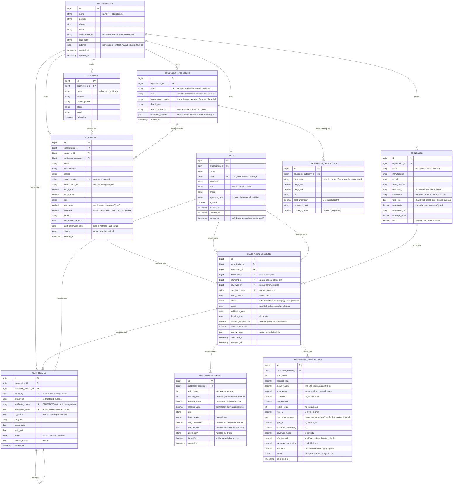
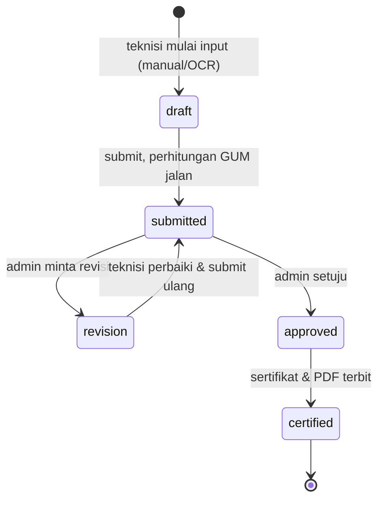

# ERD Awal — Skema Database ASMO

🏠 [[Dashboard]] · Dirancang [[2026-07-14]] (Minggu 1 Hari ke-2) · PIC Backend: **Raihan**

Rancangan tabel untuk pipeline kalibrasi: **alat → sesi kalibrasi → data mentah → perhitungan ketidakpastian → sertifikat**. Jadi acuan migration di [[2026-07-15]].

Aturan yang dipegang saat merancang: [[Aturan Bisnis Inti]]. Batas rentang & ketidakpastian per kategori: [[Data Kemampuan Kalibrasi]].

## Diagram ERD

## Kamus Tabel Singkat

| Tabel | Isinya apa | Kenapa perlu |
|---|---|---|
| `organizations` | PT / laboratorium | Akar multi-tenant. Nomor sertifikat unik **per organisasi**, jadi tenant wajib ada dari awal |
| `users` | admin / teknisi / viewer | Role menentukan akses (lihat [[Aturan Bisnis Inti]]) |
| `customers` | pelanggan pemilik alat | Master data; alat dikalibrasi atas nama pelanggan, namanya nongol di sertifikat |
| `equipment_categories` | kategori alat + kolom worksheet baku | Menentukan bentuk worksheet & metode kalibrasi yang dipakai teknisi |
| `calibration_capabilities` | rentang ukur & U terbaik (CMC) per kategori | Validasi: alat di luar rentang lab nggak boleh dikalibrasi. Sumbernya [[Data Kemampuan Kalibrasi]] |
| `equipments` | alat milik pelanggan (UUC) | Objek yang dikalibrasi; `next_calibration_date` jadi sumber notifikasi jatuh tempo |
| `standards` | alat standar milik lab | Ketidakpastian standar = komponen Type B terbesar. Wajib ada demi ketertelusuran (ISO 17025) |
| `calibration_sessions` | satu event kalibrasi 1 alat | Pusat pipeline; `status` yang jalan di alur approval |
| `raw_measurements` | angka mentah per titik & per pengulangan | Bukti audit. Manual & OCR masuk ke tabel yang **sama** |
| `uncertainty_calculations` | hasil hitung per titik ukur | Output GUM + keputusan ILAC-G8 |
| `certificates` | sertifikat terbit | Immutable; revisi = baris baru yang nunjuk ke `revision_of` |

## Alur Status Sesi Kalibrasi

Catatan: `result` (PASS/FAIL) **terpisah** dari `status`. Sesi FAIL tetap bisa lanjut ke `approved` → `certified` — sertifikat FAIL itu sah, cuma isinya beda (lihat [[Aturan Bisnis Inti]]).

## Keputusan Desain (& kenapa)

**1. `raw_measurements` = satu baris per pembacaan, bukan JSON array per titik.**
Type A butuh standar deviasi dari tiap pengulangan, dan tiap angka hasil OCR punya `ocr_confidence` + foto sendiri. Kalau ditumpuk jadi JSON, dua-duanya susah diaudit dan susah di-query ("angka mana yang keyakinan OCR-nya rendah?").

**2. Komponen Type B disimpan sebagai JSON di `uncertainty_calculations.type_b_components`.**
Bentuknya: `[{source, value, distribution, divisor, sensitivity, u_i}]` — contoh source: ketidakpastian standar, resolusi alat, drift, kondisi lingkungan. Dipilih JSON dulu karena jumlah komponennya beda-beda per kategori alat. **Kalau nanti butuh query per komponen** (misal laporan "kontribusi resolusi vs standar"), pecah jadi tabel `uncertainty_components` — migrasinya gampang karena datanya sudah terstruktur.

**3. Nilai hasil hitung disimpan, bukan dihitung on-the-fly saat baca.**
Sertifikat yang sudah terbit harus tetap menunjukkan angka yang sama 5 tahun lagi, walaupun rumus/konstantanya berubah. Hitung sekali saat submit, simpan hasilnya.

**4. `organization_id` ikut ditempel di tabel anak (`equipments`, `calibration_sessions`, `certificates`).**
Sedikit denormalisasi, tapi bikin global scope multi-tenant jadi satu `where` aja — nggak perlu join berantai cuma buat mastiin data nggak bocor antar-PT.

**5. `certificates.verification_token` (UUID), bukan `id`, yang dipakai di URL verifikasi publik.**
Endpoint verifikasi QR itu tanpa login. Kalau pakai `id` berurutan, orang bisa nebak-nebak sertifikat lain.

**6. Soft delete (`deleted_at`) di master data; data kalibrasi & sertifikat nggak boleh dihapus.**
Retensi audit 5 tahun. Alat "dihapus" harus tetap bisa ditelusuri dari sertifikat lama.

## Catatan Buat yang Bikin Migration ([[2026-07-15]])

- **Awas nama tabel `equipments`.** Inflector Laravel nganggep "equipment" itu uncountable, jadi model `Equipment` bakal nyari tabel `equipment` (tanpa `s`). Karena rencananya pakai `equipments`, set eksplisit di model: `protected $table = 'equipments';`
- Tabel `users` sudah ada dari Laravel bawaan → hari ini tinggal `ALTER` (tambah `organization_id`, `role`, `phone`, `signature_path`, `is_active`, `deleted_at`), bukan bikin baru.
- Urutan migration ngikutin arah FK: `organizations` → `users` → `customers` → `equipment_categories` → `calibration_capabilities` → `standards` → `equipments` → `calibration_sessions` → `raw_measurements` → `uncertainty_calculations` → `certificates`.
- `certificate_number` cukup `unique(organization_id, certificate_number)`. Tapi ingat: **anti-dobel nomornya tetap wajib pakai transaction locking**, unique constraint cuma jaring pengaman terakhir.
- Semua kolom nilai ukur pakai `decimal`, **jangan `float`** — hasil kalibrasi nggak boleh kena error pembulatan biner.
- Notifikasi jatuh tempo (Minggu 09) rencananya pakai tabel `notifications` bawaan Laravel + scheduled job yang nyisir `equipments.next_calibration_date`. Belum masuk ERD ini.
- Template sertifikat yang bisa dikustom admin (Minggu 08) → nanti tabel `certificate_templates`. Belum masuk ERD ini.
