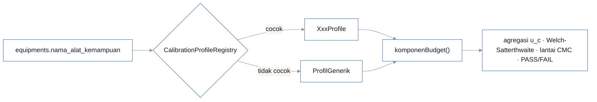
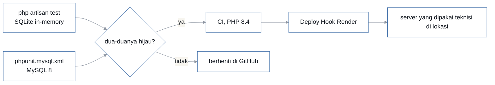
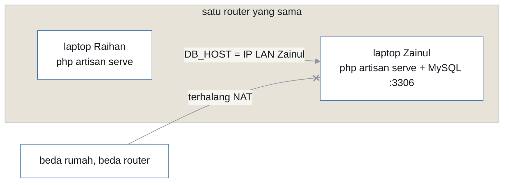

<p align="center">
  
</p>

<p align="center">
  
  
  
  
  
</p>

Backend REST API untuk kalibrasi alat ukur dan penerbitan sertifikat digital PT Sidik.
Klien utamanya repo terpisah [`sidik-calibration-mobile`](https://github.com/ZainulArkaanAlinsi/sidik-calibration-mobile)
(Flutter + Riverpod); di luar itu ada panel admin Filament di `/admin`, satu aplikasi
dengan API ini.

Yang membedakan repo ini dari CRUD biasa: **angkanya terikat standar.** Ketidakpastian
dihitung menurut JCGM 100:2008 (GUM), faktor cakupan `k` dikunci 2 sesuai lampiran
akreditasi **LK-285-IDN**, dan kelulusan diputuskan secara _guarded acceptance_ ala
ILAC-G8 — sebuah titik lulus kalau `|error| + U` masih masuk toleransi, bukan `|error|`
saja. Titik oranye di grafik atas justru yang seperti itu: simpangannya kecil, tapi
begitu ketidakpastiannya ikut dihitung, dia keluar pita.

| Komponen    | Detail                                                                    |
| ----------- | ------------------------------------------------------------------------- |
| Framework   | Laravel 13, PHP 8.3 di lokal — **8.4 di CI**, dan itu batas bawah beneran |
| Auth        | Laravel Sanctum, token-based, role `admin` / `teknisi` / `viewer`         |
| Database    | MySQL 8 (produksi), SQLite in-memory (test harian)                        |
| Panel admin | Filament 5 di `/admin`                                                    |
| Realtime    | Laravel Reverb                                                            |
| Profil alat | 28 terdaftar dari 48 jenis yang ditargetkan lab                           |

---

## Cara kerjanya

Diagram di bagian bawah gambar atas adalah jalur yang ditempuh setiap angka, dari yang
diketik teknisi di lokasi sampai yang tercetak di sertifikat. Tiga hal di jalur itu yang
paling sering disalahpahami:

**Nilai tersimpan tidak pernah dihitung ulang saat dibaca.** `uncertainty_calculations`
adalah arsip, bukan cache. Sertifikat yang terbit lima tahun lalu wajib menampilkan angka
yang sama persis hari ini, termasuk kalau rumusnya sudah diperbaiki sejak itu.

**Yang menghitung ulang justru validator, sebelum sertifikat terbit.**
`CalibrationValidator` mengambil pembacaan mentah, menghitungnya dari nol, lalu mengadu
hasilnya ke yang tersimpan. Selisihnya jadi error, peringatan, atau info.

**Ada jalur kedua.** `php artisan kalibrasi:hitung-ulang` menghitung hal yang sama lewat
kode yang lain. Alat baru wajib menyambung `App\Support\*Mentah`-nya ke
`CalibrationValidator` **dan** `HitungUlangSesi` — lupa salah satunya tidak menghasilkan
error apa pun, cuma dua jalur yang diam-diam menjawab beda. Pola ini sudah menggigit
tujuh kali.

### Profil kalibrasi

Satu jenis alat sama dengan satu berkas di `app/Services/Calibration/Profiles/`, turunan
`CalibrationProfile`. Menambah alat berarti:

```
1 subclass  +  1 seeder CMC  +  1 baris di CalibrationProfileRegistry::daftarProfil()
```

Bukan `if (besaran == ...)` yang berserakan di kelas bersama. Pencocokan alat ke profil
lewat `equipments.nama_alat_kemampuan` (plus `aliasNama()`), **bukan kategori** — pH dan
Turbidimeter satu kategori yang sama, jadi kategori tidak cukup memisahkan.

Yang tetap tinggal di kelas bersama dan tidak boleh pindah ke profil: agregasi budget
(`u_c`, Welch–Satterthwaite, `k`), lantai CMC, dan keputusan PASS/FAIL. Profil hanya
menyetor daftar komponen lewat `komponenBudget()`.



Kotak paling kanan sengaja di luar profil: itu yang tetap tinggal di kelas
bersama, dan memindahkannya ke profil berarti tiap alat boleh punya definisi
kelulusan sendiri.

### Peta lapisan

| Lapisan      | Tempat                  | Catatan                                                |
| ------------ | ----------------------- | ------------------------------------------------------ |
| Rute API     | `routes/api.php`        | ~640 baris, Sanctum + `role:`, throttle per aksi tulis |
| Panel admin  | `app/Filament/`         | `Concerns/ScopesToOrganization`                        |
| Model        | `app/Models/`           | semua data lab tersaring `organization_id`             |
| OCR / Vision | `app/Services/Ocr/`     | `WorksheetVisionExtractor`                             |
| Migrasi      | `database/migrations/`  | 86 berkas — kolom baru itu pilihan terakhir            |
| Perintah     | `app/Console/Commands/` | 20 perintah milik proyek ini                           |

---

## Setup

```bash
git clone https://github.com/ZainulArkaanAlinsi/sidik-calibration-api.git
cd sidik-calibration-api
composer setup      # install + .env + key + migrate + npm build
```

Buat databasenya, lalu sesuaikan kredensial di `.env`:

```sql
CREATE DATABASE sidik_db CHARACTER SET utf8mb4 COLLATE utf8mb4_unicode_ci;
```

```env
DB_CONNECTION=mysql
DB_DATABASE=sidik_db
DB_USERNAME=root
DB_PASSWORD=<password mysql lokal kamu>
```

Lalu jalankan semuanya sekaligus — serve, queue, log, dan vite dalam satu perintah:

```bash
composer dev
```

API ada di `http://localhost:8000/api`, health check `GET /up`, panel admin `/admin`.

Kalau mobile dites di HP fisik, jalankan `php artisan serve --host=0.0.0.0` dan arahkan
`API_BASE_URL` di app ke IP LAN laptop, bukan `localhost`.

### Perintah milik proyek ini

```bash
php artisan kalibrasi:hitung-ulang     # hitung ulang sesi dari pembacaan mentah
php artisan kalibrasi:uji-profil       # sapu profil alat lawan datanya
php artisan kemampuan:pastikan         # tegakkan baris CMC dari lampiran akreditasi
php artisan flowmeter:audit-cmc
php artisan akun:admin
```

Daftar lengkapnya di `app/Console/Commands/`.

### Generator

Dijalankan lewat skrip, bukan diketik tangan:

```bash
php docs/skrip/gen-contoh-lembar-kerja.php   # tulis contoh_lembar_kerja_*.dart ke repo mobile
php docs/skrip/gen-kode-profil-mobile.php    # ekspor daftar kode profil ke mobile
```

`docs/skrip/gen-tabel-standar-*.py` dan `gen-sesi-*.py` membangun tabel standar dan
fixture dari workbook master lab. Keluarannya disalin apa adanya; menyunting hasilnya
dengan tangan berarti berkasnya menyimpang diam-diam dari server, dan itu sudah tiga kali
meloloskan bug — TIDS, Timbangan, Micrometer.

---

## Testing

```bash
php artisan test                                  # SQLite in-memory, dipakai sehari-hari
php artisan test --filter=NamaTest                # satu kelas
php artisan test --filter='NamaTest::nama_metode' # satu metode
php artisan test -c phpunit.mysql.xml             # suite yang sama, di MySQL
```

> [!IMPORTANT]
> Dua suite itu bukan pilihan — **dua-duanya wajib hijau** sebelum sebuah modul disebut
> selesai. Produksi jalan di MySQL, sementara SQLite membaca `decimal(20,8)` sebagai
> float dan MySQL memberi string; `AUTO_INCREMENT` dan strict mode-nya juga beda. Empat
> bug pernah bersembunyi tepat di celah itu. Alasan lengkapnya ada di kepala
> `phpunit.mysql.xml`.

Sekali seumur mesin, buat database khusus test. Jangan pakai database kerja —
`RefreshDatabase` menghapus isinya.

```sql
CREATE DATABASE asmo_db_test CHARACTER SET utf8mb4 COLLATE utf8mb4_unicode_ci;
```

Jumlahnya sekarang 214 berkas `tests/Feature/` dan 49 berkas `tests/Unit/`.

CI memakai PHP **8.4**, bukan 8.3 yang tertulis di `composer.json`, dan itu batas bawah
beneran: `config/database.php` menyebut `Pdo\Mysql::ATTR_SSL_CA`, kelas yang baru ada di
8.4. Di 8.3 config-nya fatal sebelum satu test pun sempat jalan. Alurnya
`push → tes.yml → hijau → ketuk Deploy Hook Render`; commit merah berhenti di GitHub dan
tidak pernah sampai ke server yang dipakai teknisi di lokasi.

---



## Kerja berdua: database bersama lewat LAN

Tim ini memakai satu database bersama di laptop Zainul, supaya data yang dilihat berdua
persis sama. Zainul menyambung ke `127.0.0.1`, Raihan lewat IP LAN. Masing-masing tetap
menjalankan `php artisan serve` sendiri; yang dibagi cuma databasenya, bukan servernya.

```env
# .env Raihan — sisanya sama
DB_HOST=192.168.1.x       # IP laptop Zainul, cek ulang pakai `ipconfig` kalau ganti wifi
DB_DATABASE=sidik_db
DB_USERNAME=asmo_dev      # user khusus LAN, bukan root
DB_PASSWORD=<tanya langsung — jangan pernah ditulis di berkas yang ikut git>
```

Syaratnya keduanya harus benar-benar tersambung ke **router yang sama**, bukan sekadar
sama-sama memakai wifi. Satu kantor, satu rumah, satu kafe: bisa. Beda rumah: tidak —
laptop Zainul tidak bisa dihubungi dari luar karena terhalang NAT. Kalau nanti perlu
kerja dari rumah masing-masing, pindahkan DB ke cloud atau pakai VPN mesh seperti
Tailscale.

User `asmo_dev` sudah diizinkan dari semua subnet privat umum (`192.168.%`, `10.%`,
`172.16.%`), jadi ganti wifi tidak masalah. Yang wajib diperbarui cuma `DB_HOST`.

> [!CAUTION]
> **Jangan `migrate:fresh`, `migrate:refresh`, atau `db:wipe`.** Ketiganya menghapus
> semua tabel, dan karena databasenya bersama, yang hilang bukan cuma punyamu.
> `php artisan migrate` cukup dijalankan satu orang; yang lain tinggal `git pull` karena
> skemanya sudah keburu diterapkan di DB bersama.

Kalau muncul `SQLSTATE[HY000] [2002]` di sisi Raihan, urutan mengeceknya: laptop Zainul
menyala dan sejaringan? lalu, `DB_HOST` masih IP yang benar?

---



## Konvensi API

Semua endpoint di bawah `/api`. Autentikasi lewat header `Authorization: Bearer <token>`
dari Sanctum. Response selalu JSON — error pun JSON, bukan halaman HTML, dan itu diatur
di `bootstrap/app.php`. Hampir setiap aksi tulis punya `throttle:` sendiri, dan setiap
query data lab tersaring `organization_id`.

## Aturan bisnis yang mengikat

Nomor sertifikat berformat `CAL/{tahun}/{bulan}/{urutan 4 digit}`, dan keunikannya dijaga
lewat **database transaction locking**, bukan sekadar unique constraint. Sertifikat yang
sudah terbit tidak bisa diedit; revisi lahir sebagai entri baru yang terhubung ke
sertifikat asal. Hasil FAIL tetap disimpan dan tetap bisa diterbitkan sertifikatnya —
yang berbeda hanya statusnya. Rentang ukur dan ketidakpastian mengacu ke data CMC dari
lampiran akreditasi LK-285-IDN.

---

## Dokumentasi

| Berkas                                                                             | Isi                                              |
| ---------------------------------------------------------------------------------- | ------------------------------------------------ |
| [`docs/BACA-DULU-BACKEND.md`](docs/BACA-DULU-BACKEND.md)                           | satu-satunya dokumen status yang boleh dipercaya |
| [`docs/kontrak-api.md`](docs/kontrak-api.md)                                       | kontrak endpoint untuk sisi mobile               |
| [`docs/Rekap-Data-Kemampuan-Kalibrasi.md`](docs/Rekap-Data-Kemampuan-Kalibrasi.md) | ringkasan CMC LK-285-IDN                         |
| [`docs/CHECKLIST-DEPLOY-VPS.md`](docs/CHECKLIST-DEPLOY-VPS.md)                     | checklist deploy                                 |
| `docs/perintah-frontend-*.md`                                                      | serah-terima per alat ke sisi mobile             |
| `CLAUDE.md`                                                                        | panduan kerja untuk agen AI di repo ini          |

Berkas `docs/permintaan-*.md` itu permintaan **dari** sisi mobile, dan beberapa tanda
centangnya salah. Untuk status sebenarnya, baca `docs/BACA-DULU-BACKEND.md`.

## Alur kerja

Branch `main` untuk rilis, `feature/nama-fitur` untuk pekerjaan. Commit memakai
[Conventional Commits](https://www.conventionalcommits.org/). Jalankan `vendor/bin/pint`
**hanya pada berkas yang kamu sentuh** — dijalankan pada direktori, dia merapikan berkas
lain dan mengotori diff. Key `.env` baru wajib ikut ke `.env.example` dan `render.yaml`.

Repo ini privat, tapi itu bukan alasan longgar: `Project-PT-Sidik/` berisi workbook master
lab, dan riwayat git tidak ikut bersih waktu sebuah berkas dihapus. Sapu nama dan alamat
pelanggan sebelum `git add`, dan jangan pernah menulis kredensial asli di berkas yang ikut
git. Syarat lengkap kalau repo mau dibalik jadi publik ada di `CLAUDE.md`.

## Tampilan README ini

Seluruh gambarnya satu berkas: [`.github/assets/readme.svg`](.github/assets/readme.svg).
Paletnya terkumpul di satu blok komentar di kepala berkas itu — ganti warna di situ saja,
tidak perlu menyisir isinya. Animasinya hiasan semua, dan itu aturan yang ditegakkan:
tidak ada satu pun teks atau angka yang baru terlihat karena animasi, supaya isinya tidak
bisa hilang kalau animasinya tidak dijalankan.
