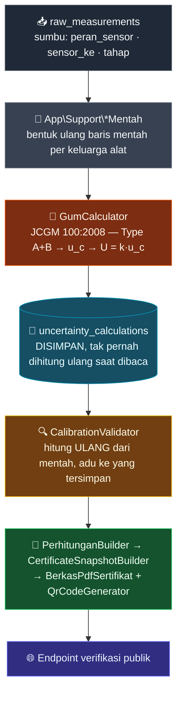

<div align="center">



<br>

[](https://laravel.com)
[](https://php.net)
[](https://filamentphp.com)
[](https://mysql.com)

[](../../actions)


<br>

[Setup Lokal](#-setup-lokal) · [Arsitektur](#-arsitektur) · [Testing](#-testing) · [Kerja Berdua](#-kerja-berdua--database-bersama-lan) · [Dokumentasi](#-dokumentasi)

</div>

---

## 📌 Tentang

Repo ini adalah **satu-satunya sumber data** untuk seluruh alur kalibrasi lab PT Sidik: dari
pembacaan mentah teknisi di lokasi, lewat mesin hitung ketidakpastian, sampai sertifikat PDF
yang bisa diverifikasi publik tanpa login.

| | |
|---|---|
| 📱 **Klien utama** | [`sidik-calibration-mobile`](https://github.com/ZainulArkaanAlinsi/sidik-calibration-mobile) — Flutter + Riverpod |
| 🖥️ **Panel admin** | Filament 5, satu aplikasi dengan API ini (bukan repo terpisah) |
| 🔐 **Auth** | Laravel Sanctum, token-based, role `admin` / `teknisi` / `viewer` |
| 📐 **Standar** | JCGM 100:2008 (GUM) · ILAC-G8 · lampiran akreditasi **LK-285-IDN** |

---

## ✨ Fitur Utama

<div align="center">

</div>

<br>

<table>
<tr>
<td width="50%" valign="top">

#### 🧪 Kalibrasi
- **28 profil alat** terdaftar dari target 48 jenis
- Input manual **maupun** hasil OCR — satu pipeline yang sama
- Lembar kerja mengikuti workbook master lab, per revisi kertas
- Perintah hitung ulang dari pembacaan mentah

</td>
<td width="50%" valign="top">

#### 📊 Angka & Ketidakpastian
- Budget Type A + Type B → `u_c` → `U = k·u_c`
- Welch–Satterthwaite, `k` dikunci **2**
- Lantai CMC ditegakkan dari lampiran akreditasi
- *Guarded acceptance*: lulus kalau `|error| + U` masuk toleransi

</td>
</tr>
<tr>
<td width="50%" valign="top">

#### 📄 Sertifikat
- Generate PDF (dompdf) + **QR code**
- Endpoint verifikasi **publik**, tanpa login
- Snapshot dibekukan — sertifikat 5 tahun lalu tetap sama angkanya
- Terbit hanya lewat approval

</td>
<td width="50%" valign="top">

#### 🏢 Operasional
- Master data organisasi, pelanggan, alamat, alat ukur
- Semua data lab tersaring `organization_id`
- Realtime lewat Laravel Reverb
- Notifikasi jatuh tempo kalibrasi

</td>
</tr>
</table>

---

## 🏗️ Arsitektur

### Jalur angka — dari pembacaan sampai sertifikat

<div align="center">

</div>

<details>
<summary><b>📐 Diagram yang sama versi Mermaid</b> — buat disunting kalau alurnya berubah</summary>

<br>



</details>

> [!IMPORTANT]
> `php artisan kalibrasi:hitung-ulang` adalah **jalur kedua** yang menghitung hal yang sama.
> Alat baru wajib menyambung `*Mentah`-nya ke `CalibrationValidator` **dan** `HitungUlangSesi`.

### Profil kalibrasi — sumbu utama repo ini

Satu jenis alat = **satu berkas** di `app/Services/Calibration/Profiles/`, turunan `CalibrationProfile`.

```
Nambah alat  =  1 subclass  +  1 seeder CMC  +  1 baris di CalibrationProfileRegistry
```

Bukan `if (besaran == ...)` yang berserakan di kelas bersama. Pencocokan alat → profil lewat
`equipments.nama_alat_kemampuan` (+ `aliasNama()`), **bukan kategori** — pH dan Turbidimeter satu
kategori yang sama, jadi kategori tidak cukup memisahkan.

Yang **tetap** di kelas bersama dan tidak boleh pindah ke profil: agregasi budget (u_c,
Welch–Satterthwaite, k), lantai CMC, dan keputusan PASS/FAIL. Profil cuma menyetor **daftar
komponen** lewat `komponenBudget()`.

### Peta lapisan

| Lapisan | Tempat | Catatan |
|:--|:--|:--|
| 🛣️ Rute API | `routes/api.php` | ~636 baris · Sanctum + `role:` · throttle per aksi tulis |
| 🎛️ Panel admin | `app/Filament/` | Filament 5 · `Concerns/ScopesToOrganization` |
| 🗃️ Model | `app/Models/` | Semua data lab disaring `organization_id` |
| 👁️ OCR / Vision | `app/Services/Ocr/` | `WorksheetVisionExtractor` |
| 📡 Realtime | Laravel Reverb | `routes/channels.php` |
| 🧬 Migrasi | `database/migrations/` | **86** berkas · kolom baru = pilihan terakhir |
| ⌨️ Perintah | `app/Console/Commands/` | **20** perintah artisan milik proyek |

---

## 🚀 Setup Lokal

```bash
git clone https://github.com/ZainulArkaanAlinsi/sidik-calibration-api.git
cd sidik-calibration-api
composer setup       # install + .env + key + migrate + npm build, sekaligus
```

Buat database, lalu sesuaikan kredensial di `.env`:

```sql
CREATE DATABASE sidik_db CHARACTER SET utf8mb4 COLLATE utf8mb4_unicode_ci;
```

```env
DB_CONNECTION=mysql
DB_DATABASE=sidik_db
DB_USERNAME=root
DB_PASSWORD=<password mysql lokal kamu>
```

Jalankan semuanya sekaligus:

```bash
composer dev         # serve + queue:listen + pail + vite
```

API tersedia di `http://localhost:8000/api` · health check `GET /up` · panel admin di `/admin`.

> [!TIP]
> Kalau mobile dites di **HP fisik**, jalankan `php artisan serve --host=0.0.0.0` dan arahkan
> `API_BASE_URL` di app ke **IP LAN** laptop (mis. `http://192.168.1.10:8000/api`), bukan `localhost`.

<details>
<summary><b>⌨️ Perintah artisan milik proyek ini</b></summary>

<br>

```bash
php artisan kalibrasi:hitung-ulang     # hitung ulang sesi dari pembacaan mentah
php artisan kalibrasi:uji-profil       # sapu profil alat lawan datanya
php artisan kalibrasi:sapu-sesi
php artisan kemampuan:pastikan         # tegakkan baris CMC dari lampiran akreditasi
php artisan flowmeter:audit-cmc
php artisan akun:admin
```

Daftar lengkapnya (20 perintah) ada di `app/Console/Commands/`.

</details>

<details>
<summary><b>🔁 Generator — dijalankan, bukan diketik tangan</b></summary>

<br>

```bash
php docs/skrip/gen-contoh-lembar-kerja.php   # tulis contoh_lembar_kerja_*.dart ke repo mobile
php docs/skrip/gen-kode-profil-mobile.php    # ekspor daftar kode profil ke mobile
```

`docs/skrip/gen-tabel-standar-*.py` dan `gen-sesi-*.py` membangun tabel standar & fixture dari
workbook master. **Keluarannya disalin apa adanya** — menyunting hasilnya dengan tangan sudah
tiga kali meloloskan bug (TIDS, Timbangan, Micrometer).

</details>

---

## 🧪 Testing

```bash
php artisan test                                  # SQLite in-memory — dipakai sehari-hari
php artisan test --filter=NamaTest                # satu kelas
php artisan test --filter='NamaTest::nama_metode' # satu metode
php artisan test -c phpunit.mysql.xml             # suite yang sama, di MySQL
```

> [!WARNING]
> **Dua suite itu bukan pilihan — dua-duanya wajib hijau** sebelum modul disebut selesai.
> Produksi jalan di MySQL; SQLite membaca `decimal(20,8)` sebagai *float* sementara MySQL memberi
> *string*, `AUTO_INCREMENT`-nya beda, dan strict mode-nya beda. **Empat bug pernah bersembunyi di
> celah itu.** Alasan lengkapnya ada di kepala `phpunit.mysql.xml`.

Sekali seumur mesin, buat database khusus test — **bukan** database kerja, karena `RefreshDatabase`
menghapus isinya:

```sql
CREATE DATABASE asmo_db_test CHARACTER SET utf8mb4 COLLATE utf8mb4_unicode_ci;
```

<div align="center">

| Suite | Berkas test |
|:--|:--:|
| `tests/Feature/` | **214** |
| `tests/Unit/` | **49** |

</div>

### Kenapa CI beda dari lokal

CI memakai **PHP 8.4**, bukan 8.3 yang tertulis di `composer.json` — dan itu batas bawah beneran:
`config/database.php` menyebut `Pdo\Mysql::ATTR_SSL_CA`, kelas yang baru ada di 8.4. Di 8.3
config-nya fatal sebelum satu test pun jalan.

```
push → .github/workflows/tes.yml → hijau? → ketuk Deploy Hook Render
                                 └ merah? berhenti di GitHub, tidak sampai ke teknisi di lokasi
```

---

## 🤝 Kerja Berdua — Database Bersama (LAN)

Tim ini pakai **satu database bersama** di laptop Zainul, biar data yang dilihat berdua persis sama.
Zainul connect ke `127.0.0.1`, Raihan connect lewat IP LAN.

```env
# .env Raihan — sisanya sama
DB_CONNECTION=mysql
DB_HOST=192.168.1.46      # IP laptop Zainul — cek ulang pakai `ipconfig` kalau ganti wifi
DB_PORT=3306
DB_DATABASE=sidik_db
DB_USERNAME=asmo_dev      # user khusus LAN, bukan root
DB_PASSWORD=<tanya Zainul langsung — JANGAN ditulis di berkas yang ikut git>
```

Masing-masing tetap jalanin `php artisan serve` sendiri di laptopnya — yang dibagi cuma
databasenya, bukan servernya.

### Syaratnya: harus SATU jaringan yang sama

| Situasi | Bisa? |
|:--|:--:|
| Berdua di kantor, satu wifi | ✅ |
| Berdua di rumah salah satu, satu wifi | ✅ |
| Berdua di kafe, satu wifi | ✅ |
| Zainul di rumahnya, Raihan di rumahnya (wifi beda) | ❌ |

"Satu wifi" artinya benar-benar **nyambung ke router yang sama**, bukan sekadar sama-sama pakai
wifi. Kalau beda rumah, laptop Zainul nggak bisa dihubungi dari luar (kehalang NAT/router). Kalau
perlu kerja dari rumah masing-masing: pindahkan DB ke cloud (Railway/Aiven) atau pakai VPN mesh
(Tailscale).

User MySQL `asmo_dev` sudah dibolehkan dari semua subnet privat umum (`192.168.%`, `10.%`,
`172.16.%`), jadi ganti wifi nggak masalah — **yang wajib diupdate cuma `DB_HOST`**, karena IP
laptop Zainul berubah tiap ganti jaringan.

> [!CAUTION]
> **Aturan wajib kalau DB dipakai bareng**
>
> - 🚫 **JANGAN `migrate:fresh` / `migrate:refresh` / `db:wipe`** — perintah itu menghapus SEMUA
>   tabel, dan karena databasenya bersama, yang kehapus bukan cuma punyamu tapi punya berdua.
> - ✅ `php artisan migrate` **cukup dijalankan satu orang** (siapa pun yang bikin migration-nya).
>   Yang lain tinggal `git pull` — skemanya sudah keburu ke-apply di DB bersama.
> - 💻 Laptop Zainul harus **nyala dan sejaringan** biar Raihan bisa connect.
> - 🔌 Error `SQLSTATE[HY000] [2002]`? Urutan ngecek: (1) laptop Zainul nyala & sejaringan?
>   (2) `DB_HOST` masih IP yang benar? cek `ipconfig`.

Menyiapkan mesin kedua supaya isinya sama persis — termasuk toolchain, berkas yang tidak ikut git,
dan cara memindahkan isi database: lihat [`docs/sinkron-laptop-windows.md`](docs/sinkron-laptop-windows.md).
Untuk membuktikan dua mesin sudah sama: `./scripts/cek-sinkron.sh`.

---

## 📖 Konvensi API

| Aturan | Detail |
|:--|:--|
| Prefix | Semua endpoint di bawah `/api` — lihat `routes/api.php` |
| Auth | Bearer token Sanctum: `Authorization: Bearer <token>` |
| Response | **Selalu JSON** — error pun JSON, bukan halaman HTML (`bootstrap/app.php`) |
| Throttle | Hampir tiap aksi tulis punya `throttle:` sendiri |
| Scoping | Setiap query data lab tersaring `organization_id` |

---

## 📐 Aturan Bisnis Penting

- **Nomor sertifikat** format `CAL/{tahun}/{bulan}/{urutan 4 digit}` — keunikan dijaga lewat
  **database transaction locking**, bukan cuma unique constraint.
- **Sertifikat yang sudah terbit tidak bisa diedit** — revisi lewat entry baru yang terhubung ke
  sertifikat asal.
- **Hasil FAIL tetap disimpan** dan tetap bisa diterbitkan sertifikatnya — yang beda cuma statusnya.
- **Nilai tersimpan tidak pernah dihitung ulang saat dibaca.** Sertifikat lima tahun lalu wajib
  tetap sama angkanya.
- **Rentang ukur & ketidakpastian** mengacu ke data CMC dari lampiran akreditasi LK-285-IDN.

---

## 📚 Dokumentasi

| Berkas | Isi |
|:--|:--|
| [`docs/BACA-DULU-BACKEND.md`](docs/BACA-DULU-BACKEND.md) | **Satu-satunya dokumen status yang boleh dipercaya** |
| [`docs/kontrak-api.md`](docs/kontrak-api.md) | Kontrak endpoint untuk sisi mobile |
| [`docs/Rekap-Data-Kemampuan-Kalibrasi.md`](docs/Rekap-Data-Kemampuan-Kalibrasi.md) | Ringkasan CMC LK-285-IDN |
| [`docs/CHECKLIST-DEPLOY-VPS.md`](docs/CHECKLIST-DEPLOY-VPS.md) | Checklist deploy |
| `docs/perintah-frontend-*.md` | Serah-terima per alat ke sisi mobile |
| `CLAUDE.md` | Panduan kerja untuk agen AI di repo ini |

> [!NOTE]
> Berkas `docs/permintaan-*.md` itu **permintaan dari sisi mobile** — beberapa tanda ✅-nya salah.
> Untuk status sebenarnya, baca `docs/BACA-DULU-BACKEND.md`.

---

## 🌱 Git Workflow

- Branch: `main` (rilis) · `feature/nama-fitur`
- Commit pakai [Conventional Commits](https://www.conventionalcommits.org/) — `feat:`, `fix:`, `refactor:`, `docs:`, …
- `vendor/bin/pint` **hanya pada berkas yang kamu sentuh** — dijalankan pada direktori, dia
  merapikan berkas lain dan mengotori diff.
- Key `.env` baru wajib ikut ke `.env.example` **dan** `render.yaml`.

> [!CAUTION]
> **Repo ini PUBLIK.** Sapu nama/alamat pelanggan sebelum `git add` apa pun dari
> `Project-PT-Sidik/`, dan jangan pernah menulis kredensial asli di berkas yang ikut git.

---

<div align="center">

<sub>PT Sidik · Lab kalibrasi terakreditasi <b>LK-285-IDN</b></sub>

<sub>Dibangun dengan Laravel 13 · Filament 5 · MySQL 8</sub>

</div>
